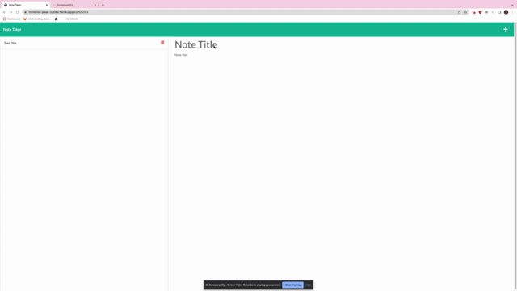
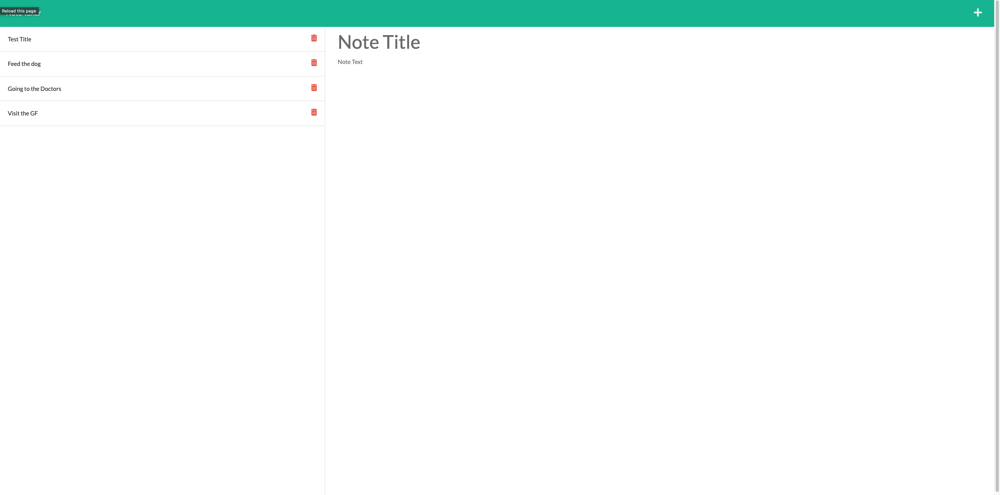

# Notebook-Writer

## Description

My motivation to build this note taker was to practice and implement my knowledge of routes, express.js, and heroku. I wanted to deploy a working application to heroku and hopefully use it to keep track of tasks that I need to finish.

## Deployment Link

Link to visit app deployed at Heroku: https://immense-peak-32683.herokuapp.com/

## Table of Contents 

- [Installation](#installation)
- [Usage](#usage)
- [Credits](#credits)
- [License](#license)

## Installation

To download the raw code of the page follow the steps below:

In the jeffz98-portfolio Repository, copy the Code 
Open your version of terminal and enter > git clone git@github.com:jeffz98/Notebook-Writer.git
After that the code is now on your local machine and you are free to copy it to your own repository and make changes

## Usage

Demo Gif:

Screenshot:

## Credits

[W3 Schools](https://www.w3schools.com/)

## License

MIT License
---

